<div align="center">


<p>
  <a href="https://shirshadip-portfolio.shirshadip.workers.dev/">
    
  </a>
  <a href="https://www.linkedin.com/in/shirshadip-samajder-557552309">
    
  </a>
  <a href="https://github.com/shirshadip?tab=repositories">
    
  </a>
</p>


</div>

<br/>


## 👨‍💻 About Me

```python
#!/usr/bin/env python3

class Developer:
    def __init__(self):
        self.name = "Shirshadip Samajder"
        self.role = "Computer Science Student 🎓"
        self.location = "India 🇮🇳"
        self.languages = {
            "expert": ["Python 🐍", "C"],
            "proficient": ["C++", "JavaScript"],
            "learning": ["React ⚛️", "Web Dev 🌐"]
        }
        self.interests = [
            "🔐 Cybersecurity & Networking",
            "📊 Data Science & Analytics", 
            "⚙️ Systems Programming & OS",
            "🔧 IoT & Embedded Systems",
            "🧮 Physics & Mathematics"
        ]
        
    def current_focus(self):
        return [
            "🔥 Mastering Advanced Python",
            "🔐 Deep Diving into Cybersecurity",
            "🌐 Building Web Applications",
            "🔧 Exploring Low-Level Systems & OS"
        ]
    
    def say_hello(self):
        print("Thanks for visiting! Let's connect and build amazing things! 🌟")

me = Developer()
me.say_hello()
```

<br clear="right"/>

---

## 🛠️ My Tech Arsenal

<div align="center">

<table>
<tr>
<td align="center" width="96">

<br>Python
</td>
<td align="center" width="96">

<br>C
</td>
<td align="center" width="96">

<br>C++
</td>
<td align="center" width="96">

<br>Git
</td>
<td align="center" width="96">

<br>MySQL
</td>

<td align="center" width="96">
  
  <br>Jupyter
</td>

<td align="center" width="96">

<br>HTML
</td>
</tr>
<tr>
<td align="center" width="96">

<br>CSS
</td>
<td align="center" width="96">

<br>JavaScript
</td>
<td align="center" width="96">

<br>React
</td>
<td align="center" width="96">

<br>IoT
</td>
<td align="center" width="96">

<br>Linux
</td>
<td align="center" width="96">

<br>VS Code
</td>
<td align="center" width="96">

<br>GitHub
</td>
</tr>
</table>

</div>

---

## 📊 GitHub Analytics

<div align="center">
  


</div>

<div align="center">
  
</div>

---

## 🎯 Current Learning Path

```mermaid
graph LR
    A[🎓 Computer Science] --> B[🐍 Python & Web Dev]
    A --> C[🔐 Cybersecurity]
    A --> D[⚙️ Systems & OS]
    B --> E[🌐 Full Stack]
    C --> F[🛡️ Security Expert]
    D --> F
    C --> G[📡 Networking]
    D --> H[🔧 Low-Level Dev]
    E --> I[🚀 Real Projects]
    F --> I
    H --> I
    style A fill:#00D9FF,stroke:#fff,stroke-width:2px,color:#000
    style C fill:#FF0000,stroke:#fff,stroke-width:2px,color:#fff
    style I fill:#FF6D00,stroke:#fff,stroke-width:2px,color:#fff
```

<div align="center">



</div>

<table>
<tr>
<td width="50%" valign="top">

### 🐍 Python & Web Development
- ✅ Advanced data structures & algorithms
- ✅ Object-oriented design patterns
- 🔄 React & modern web frameworks
- 🔄 Full-stack development
- ⏳ RESTful APIs & backend systems

</td>
<td width="50%" valign="top">

### 🔐 Cybersecurity Fundamentals
- ✅ Network protocols & architecture
- 🔄 Operating system security
- 🔄 Cryptography basics
- ⏳ Penetration testing concepts
- ⏳ Ethical hacking techniques

</td>
</tr>
<tr>
<td width="50%" valign="top">

### 🔧 Systems & Low-Level Programming
- ✅ Memory management & pointers (C/C++)
- 🔄 Operating systems internals
- 🔄 Computer architecture
- ⏳ Assembly language basics
- ⏳ Kernel programming concepts

</td>
<td width="50%" valign="top">

### 📊 Science Background
- ✅ Physics fundamentals & mechanics
- ✅ Mathematics (Calculus & Linear Algebra)
- 🔄 Statistical analysis & probability
- 🔄 IoT & embedded systems
- ⏳ Quantum computing basics

</td>
</tr>
</table>

<div align="center">
  
**Legend:** ✅ Completed | 🔄 In Progress | ⏳ Planned

</div>

---

## 🏆 Achievements & Highlights

<div align="center">

<a href="https://github.com/shirshadip">
  
</a>
<a href="https://github.com/shirshadip">
  
</a>
<a href="https://github.com/shirshadip">
  
</a>

</div>

<br/>

<details>
<summary>📈 <b>More GitHub Metrics</b> (Click to expand)</summary>
<br/>

<div align="center">


</div>

</details>

---

## 💼 Featured Projects

<div align="center">

<a href="https://github.com/shirshadip?tab=repositories">
  
</a>
<a href="https://github.com/shirshadip?tab=repositories">
  
</a>

<br/><br/>

<a href="https://github.com/shirshadip?tab=repositories">
  
</a>

</div>

---

## 🎨 Coding Activity

<div align="center">

<!--START_SECTION:waka-->
<!--END_SECTION:waka-->


</div>

---

## 🌟 Fun Facts & Interests


- 🎯 **Problem Solver**: Love tackling algorithmic challenges
- 🔐 **Security Enthusiast**: Passionate about cybersecurity & network security
- 📚 **Continuous Learner**: Always exploring new technologies
- 🔬 **Science Nerd**: Strong foundation in Physics & Mathematics
- 🌐 **Web Developer**: Building responsive and dynamic web applications
- 🔧 **IoT Explorer**: Experimenting with embedded systems & hardware
- 💡 **Low-Level Curious**: Fascinated by OS internals and computer architecture
- ☕ **Coffee Lover**: Fueled by caffeine and curiosity

<br clear="right"/>

---

## 💬 Let's Connect!

<div align="center">

<a href="https://shirshadip-portfolio.shirshadip.workers.dev/">
  
</a>
<a href="https://www.linkedin.com/in/shirshadip-samajder-557552309">
  
</a>
<a href="https://github.com/shirshadip">
  
</a>
<a href="mailto:shirshadip@outlook.com">
  
</a>

<br/><br/>

### 💭 Quote of the Day


<br/>

### 🐍 Contribution Snake

<picture>
  <source media="(prefers-color-scheme: dark)" srcset="https://raw.githubusercontent.com/shirshadip/shirshadip/output/github-contribution-grid-snake-dark.svg">
  <source media="(prefers-color-scheme: light)" srcset="https://raw.githubusercontent.com/shirshadip/shirshadip/output/github-contribution-grid-snake.svg">
  
</picture>

<br/><br/>

---


### ⭐ Thanks for visiting! Feel free to star ⭐ repositories you find interesting!


</div>